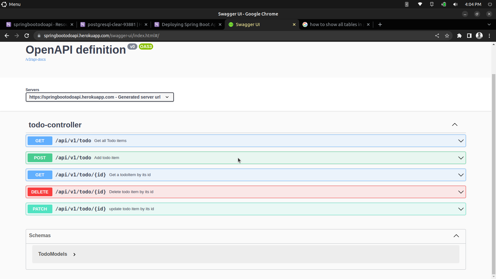

# springboot todo Rest api
This a todo rest api create with Java Spring boot
<div>
</div>

## Built With

- JAVA
- JAVA SPRING-BOOT


## Getting Started

To get a local copy, follow these simple example steps.

### Prerequisites

A computer with a working and up to date web browser.

### Setup

- Clone the repository to your folder of choice using Git (or just download all the files)
- Install JVM
- Install Java IDE of your choice

```
$ git clone https://github.com/saretoduncan/spingbootTodoApi.git


```
### Live Link
https://springbootodoapi.herokuapp.com/swagger-ui/index.html#/

## Author

👤 **Author**

By Duncan Kipkosgei Moiyo

- GitHub: [@saretoduncan](https://github.com/saretoduncan)
- twitter: [@duncan_sareto](https://twitter.com/duncan_sareto)
- email: <a href="mailto:duncan.moiyo@student.moringaschool.com"> mail📪</a>

## 🤝 Contributing

Contributions, issues, and feature requests are welcome!

Feel free to check the [issues page](./ISSUE_TEMPLATE/feature_request.md).


## Show your support

Give a ⭐️ if you like this project!


## 📝 License

This project is [MIT](./LICENSE) licensed.